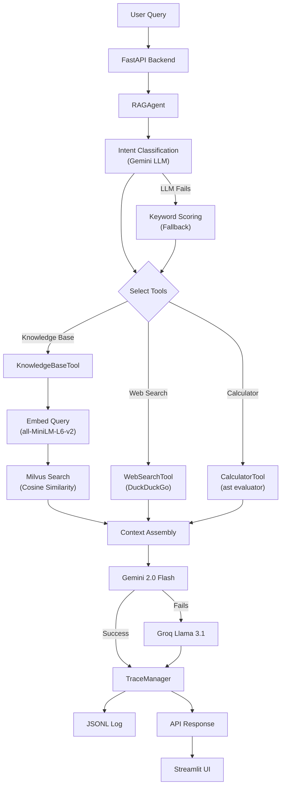
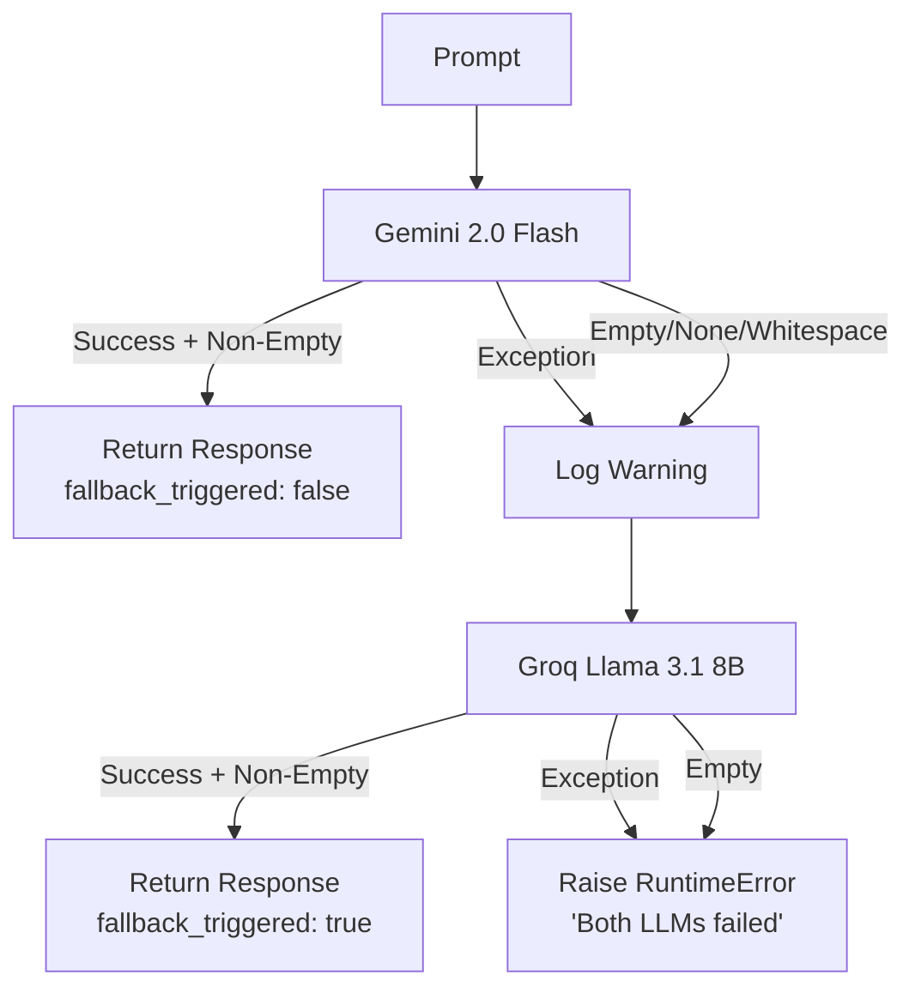

# 🤖 Mini Agentic RAG Application

A production-ready **Retrieval-Augmented Generation** application with a single-agent architecture, LLM-powered intent classification, tool execution (calculator + web search + knowledge base), dual LLM fallback, and structured tracing.

## ✨ Key Features

- **LLM-Powered Routing** — Gemini classifies user intent and selects tools; keyword-scoring fallback handles rate limits
- **Single Agent with Tools** — One `RAGAgent` orchestrates KnowledgeBaseTool, WebSearchTool, and CalculatorTool
- **Dual LLM with Fallback** — Primary: Google Gemini 2.0 Flash, Fallback: Groq Llama 3.1 8B. Seamless failover if primary is unavailable
- **Multi-Source Ingestion** — Upload PDFs or scrape URLs into the vector knowledge base
- **Safe Calculator** — AST-based math evaluator (no `eval()`) for arithmetic queries
- **Web Search** — DuckDuckGo-powered search for queries outside the knowledge base
- **Vector Search** — Milvus Lite with cosine similarity, no Docker required
- **Structured Tracing** — Every query produces a JSONL trace with routing decisions, tool execution status, latency, and model info
- **Modern UI** — Streamlit frontend with real-time agent trace visualisation
- **Docker Ready** — One Dockerfile, two-service docker-compose for easy deployment

## 🏗️ Architecture



## 📋 Prerequisites

- **Python** 3.11 or higher
- **pip** (latest version recommended)
- **API Keys:**
  - [Google Gemini API Key](https://aistudio.google.com/app/apikey) (free tier available)
  - [Groq API Key](https://console.groq.com/keys) (free tier available)

## 🚀 Setup Instructions

### 1. Clone the repository

```bash
git clone https://github.com/Jigil-ak/Mini-Agentic-Rag-Application.git
cd Mini-Agentic-Rag-Application
```

### 2. Create a virtual environment

```bash
python -m venv venv

# Windows
venv\Scripts\activate

# macOS/Linux
source venv/bin/activate
```

### 3. Install dependencies

```bash
pip install -r requirements.txt
```

### 4. Configure environment variables

```bash
cp .env.example .env
```

Edit `.env` and add your API keys:

```env
GEMINI_API_KEY=your_actual_gemini_api_key
GROQ_API_KEY=your_actual_groq_api_key
```

### 5. Start the backend

```bash
uvicorn backend.main:app --reload
```

The API will be available at `http://localhost:8000`

### 6. Start the frontend (in a new terminal)

```bash
streamlit run frontend/app.py
```

The UI will open at `http://localhost:8501`

## ⚙️ Environment Variables

| Variable | Description | Required | Default |
|----------|-------------|----------|---------|
| `GEMINI_API_KEY` | Google Gemini API key | ✅ Yes | — |
| `GROQ_API_KEY` | Groq API key for fallback LLM | ✅ Yes | — |
| `SIMILARITY_THRESHOLD` | RAG vs Tool routing threshold (0.0–1.0) | No | `0.6` |
| `CHUNK_SIZE` | Text chunk size in characters | No | `500` |
| `CHUNK_OVERLAP` | Overlap between consecutive chunks | No | `50` |
| `TOP_K` | Number of chunks to retrieve | No | `3` |
| `EMBEDDING_MODEL` | Sentence transformer model name | No | `all-MiniLM-L6-v2` |
| `PRIMARY_MODEL` | Primary LLM model | No | `gemini-2.0-flash` |
| `FALLBACK_MODEL` | Fallback LLM model | No | `llama-3.1-8b-instant` |
| `MILVUS_DB_PATH` | Path to Milvus Lite database file | No | `./data/milvus_demo.db` |
| `COLLECTION_NAME` | Milvus collection name | No | `rag_documents` |
| `LOG_FILE` | Path to JSONL trace log file | No | `./logs/agent_logs.jsonl` |
| `FASTAPI_PORT` | FastAPI server port | No | `8000` |

## 📡 API Reference

### Health Check

```bash
curl http://localhost:8000/health
```

Response:
```json
{
  "status": "ok",
  "milvus": "connected",
  "documents_indexed": 42
}
```

### Load a PDF

```bash
curl -X POST http://localhost:8000/load \
  -F "file=@document.pdf"
```

Response:
```json
{
  "status": "success",
  "chunks_loaded": 15,
  "source": "document.pdf"
}
```

### Load a URL

```bash
curl -X POST http://localhost:8000/load \
  -F "url=https://en.wikipedia.org/wiki/Retrieval-augmented_generation"
```

Response:
```json
{
  "status": "success",
  "chunks_loaded": 23,
  "source": "https://en.wikipedia.org/wiki/Retrieval-augmented_generation"
}
```

### Ask a Question

```bash
curl -X POST http://localhost:8000/query \
  -H "Content-Type: application/json" \
  -d '{"query": "What is retrieval-augmented generation?"}'
```

Response:
```json
{
  "answer": "Retrieval-augmented generation (RAG) is...",
  "trace": {
    "trace_id": "a1b2c3d4-...",
    "query": "What is retrieval-augmented generation?",
    "path_taken": "rag",
    "similarity_score": 0.82,
    "response_time_ms": 1250.5,
    "...": "..."
  }
}
```

### Get Recent Traces

```bash
curl http://localhost:8000/traces
```

## 🔄 Agent Workflow

1. **User submits a query** via the Streamlit UI or API
2. **TraceManager** starts a new trace record with a unique ID
3. **RAGAgent** classifies intent using Gemini LLM (falls back to keyword scoring on failure)
4. **Tool selection**: the agent picks one or more tools — `knowledge_base`, `web_search`, `calculator`
5. **Tool execution**: each tool runs independently
   - KnowledgeBaseTool embeds the query and searches Milvus (cosine similarity)
   - WebSearchTool queries DuckDuckGo
   - CalculatorTool evaluates arithmetic via safe AST parser
6. **Context assembly**: tool outputs are combined into a structured prompt
7. **LLM generation** with fallback: try Gemini first, fall back to Groq on failure
8. **TraceManager** records the full trace (tools, routing method, model, latency, status) to JSONL
9. **Response** is returned with the answer and complete trace metadata

## 🔀 Fallback Logic



## 📊 Trace Log Format

Each query appends one JSON line to `logs/agent_logs.jsonl`:

```json
{
  "trace_id": "f47ac10b-58cc-4372-a567-0e02b2c3d479",
  "query": "What is machine learning?",
  "timestamp": "2024-01-15T10:30:00.123456+00:00",
  "retrieval_hit": false,
  "similarity_score": 0.0,
  "path_taken": "web_search",
  "routing_reason": "",
  "tool_used": "web_search",
  "tool_output_preview": null,
  "primary_model": "gemini-2.0-flash",
  "fallback_triggered": false,
  "chunks_used": 0,
  "response_time_ms": 1423.56,
  "error": null,
  "selected_tools": ["web_search"],
  "tool_reasoning": "General knowledge question about machine learning",
  "routing_decision_timestamp": "2024-01-15T10:30:00.000000+00:00",
  "routing_method": "llm",
  "routing_type": "web_search",
  "tool_execution_results": {"web_search": "1. [Machine Learning]: ..."},
  "tool_execution_status": {"web_search": "success"}
}
```

| Field | Type | Description |
|-------|------|-------------|
| `trace_id` | string | Unique UUID for this query |
| `query` | string | The user's original question |
| `timestamp` | string | ISO 8601 timestamp (UTC) |
| `selected_tools` | list | Tools selected by the agent (e.g. `["web_search"]`) |
| `routing_type` | string | `"knowledge_base"`, `"web_search"`, `"calculator"`, or `"multi_tool"` |
| `routing_method` | string | `"llm"` (Gemini classified) or `"keyword_fallback"` |
| `tool_reasoning` | string | Agent's explanation of tool selection |
| `routing_decision_timestamp` | string | ISO timestamp of the routing decision |
| `tool_execution_results` | object | Truncated tool outputs keyed by tool name |
| `tool_execution_status` | object | Status per tool: `"success"`, `"empty"`, or `"failed"` |
| `retrieval_hit` | bool | Whether KB retrieval returned results |
| `similarity_score` | float | Cosine similarity score of the top chunk |
| `path_taken` | string | Joined tool names (e.g. `"knowledge_base+web_search"`) |
| `tool_used` | string\|null | First selected tool (backward compat) |
| `primary_model` | string | LLM model that generated the response |
| `fallback_triggered` | bool | Whether the fallback LLM was used |
| `chunks_used` | int\|null | Number of RAG chunks used |
| `response_time_ms` | float | Total query processing time in milliseconds |
| `error` | string\|null | Error message if the query failed |

## 🧪 Running Tests

```bash
pytest tests/ -v
```

Expected output:
```
tests/test_calculator.py::TestBasicArithmetic::test_addition PASSED
tests/test_calculator.py::TestBasicArithmetic::test_subtraction PASSED
tests/test_calculator.py::TestSecurityPrevention::test_import_blocked PASSED
tests/test_router.py::TestRAGRouting::test_high_similarity_routes_to_rag PASSED
tests/test_router.py::TestToolRouting::test_low_similarity_routes_to_tool PASSED
tests/test_fallback.py::TestPrimarySuccess::test_primary_succeeds_no_fallback PASSED
tests/test_fallback.py::TestFallbackTriggered::test_primary_exception_triggers_fallback PASSED
tests/test_url_loader.py::TestSuccessfulExtraction::test_valid_html_returns_text PASSED
...
```

## 📁 Project Structure

```
project/
├── backend/
│   ├── api/
│   │   ├── __init__.py
│   │   └── routes.py          # FastAPI endpoints
│   ├── agent/
│   │   ├── __init__.py
│   │   ├── agent.py           # Single RAGAgent (LLM routing + tool execution)
│   │   ├── router.py          # Legacy threshold router (kept, not used)
│   │   ├── rag_agent.py       # Legacy RAG pipeline (kept, not used)
│   │   ├── tool_agent.py      # Legacy tool agent (kept, not used)
│   │   └── fallback.py        # LLM fallback orchestration
│   ├── ingestion/
│   │   ├── __init__.py
│   │   ├── pdf_loader.py      # PDF text extraction
│   │   ├── url_loader.py      # URL scraping
│   │   ├── chunking.py        # Text splitting
│   │   └── embedding.py       # Sentence transformer embeddings
│   ├── vectordb/
│   │   ├── __init__.py
│   │   └── milvus_client.py   # Milvus Lite vector store
│   ├── llm/
│   │   ├── __init__.py
│   │   ├── primary_llm.py     # Gemini 2.0 Flash
│   │   └── fallback_llm.py    # Groq Llama 3.1 8B
│   ├── tools/
│   │   ├── __init__.py
│   │   ├── calculator.py      # Safe math evaluator
│   │   └── web_search.py      # DuckDuckGo search
│   ├── tracing/
│   │   ├── __init__.py
│   │   └── tracer.py          # JSONL trace logger
│   ├── __init__.py
│   ├── config.py              # Central configuration
│   └── main.py                # FastAPI app entry point
├── frontend/
│   └── app.py                 # Streamlit UI
├── tests/
│   ├── __init__.py
│   ├── test_calculator.py
│   ├── test_router.py
│   ├── test_fallback.py
│   └── test_url_loader.py
├── data/                      # Milvus Lite database (auto-created)
├── logs/                      # Trace logs (auto-created)
├── Dockerfile                 # Single image for both services
├── docker-compose.yml         # Backend + Frontend services
├── requirements.txt
├── .env.example
└── README.md
```

## 🐳 Docker Deployment

Build and run both services with Docker Compose:

```bash
docker compose up --build
```

- **Backend**: `http://localhost:8000`
- **Frontend**: `http://localhost:8501`

To run in detached mode:

```bash
docker compose up --build -d
```

To stop:

```bash
docker compose down
```

The `data/` and `logs/` directories are mounted as volumes, so your Milvus database and trace logs persist across container restarts.

## 🧠 Intent Classification System

The agent uses a two-tier intent classification system:

### Primary: LLM-Based Routing (Gemini)

Gemini analyzes the query and selects tools from:
- `knowledge_base` — personal documents, resumes, uploaded content
- `web_search` — general knowledge, current events, technology explanations
- `calculator` — arithmetic expressions and computation requests

Multiple tools can be selected for comparison queries (e.g., "Compare my skills with industry trends" → `knowledge_base` + `web_search`).

### Fallback: Keyword Scoring

When Gemini is rate-limited (429) or unavailable, a keyword-scoring system takes over. The trace records `routing_method: "keyword_fallback"` so you can monitor how often this occurs.

## 📄 License

This project is for educational and demonstration purposes.
